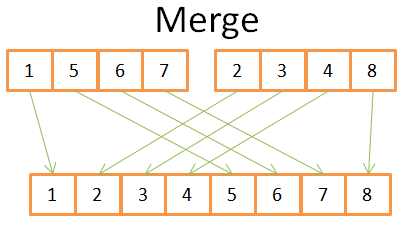
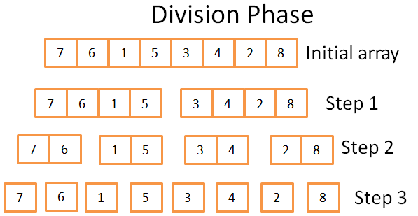
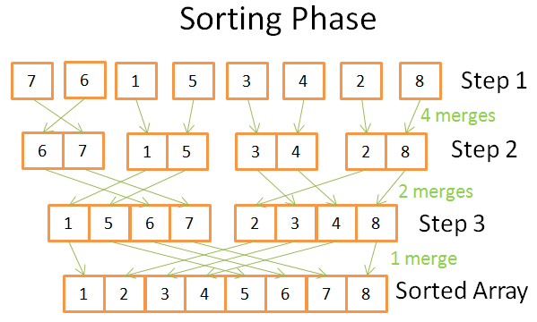

# Algorithms: sorting

## [Merge sort](http://coding-geek.com/how-databases-work/#Merge_Sort)



1) You compare both current elements in the 2 arrays (current=first for the first time)
2) then take the lowest one to put it in the 8-element array
3) and go to the next element in the array you took the lowest element
4) and repeat 1,2,3 until you reach the last element of one of the arrays.
5) Then you take the rest of the elements of the other array to put them in the 8-element array.

```ts
function mergeSort(arr: []Number) {
  if (arr.length === 1) {
     return arr[0]
  }

  const [left, right] = splitInto2EqualSizedArrays(arr)
  const newLeft = mergeSort(arr)
  const newRight = mergeSort(arr)

  const res = newLeft.concat(newRight)
  return res
}
```
In practice, this is divided in 2 phases: division and sorting.




