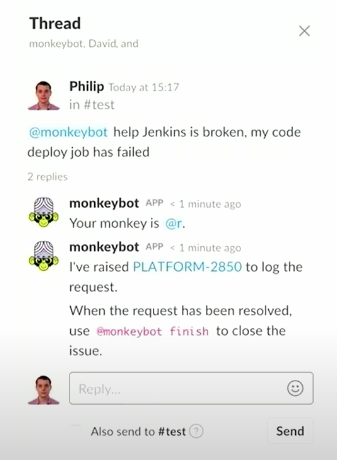

# Bug triaging

## Using chatbots

From [this video from Andy Burgin, Platform Engineer, Sky Betting and Gaming in Leeds](https://youtu.be/0byzc7E-Fho?t=1325)

- Establish a support rota
- Creates the story on Jira
- Assigns it
- Tracks the time spent
- Tracks the project affected

When resolved, @monkeybot closes the ticket and compiles the stats.
