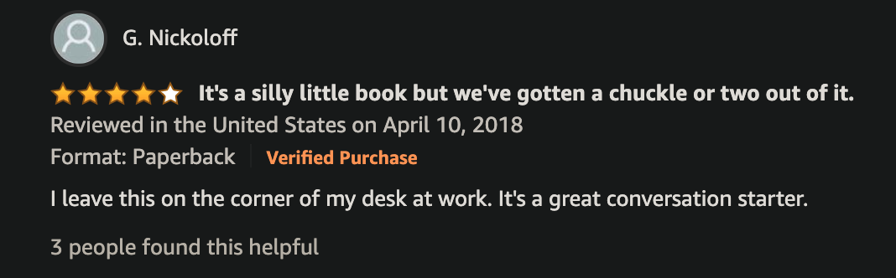

# Communication

Warning: not all of this is supposed to be particularly serious.

## How to facilitate conversation

- Leave a weird book at the side of your desk. [Reference](https://www.amazon.com/Rude-Hand-Gestures-World-Offending/dp/0811878074)

## How to convince people

[Source](https://github.com/nobitagit/knowledge.git)

When someone is gatekeeping:

- "Have you ever made an exception?"

When someone is stomping their feet and doesn't agree with you at all:

- "If I was in your position, I would feel the same" (taking their side so they are more likely to change their mind)

- Use the other person name, when you are talking to someone

## When to ramp up communication

In moments of uncertainty, it's more important to communicate more. See [this video](https://www.ted.com/talks/amy_c_edmondson_how_to_lead_in_a_crisis?referrer=playlist-the_way_we_work_season_3).
