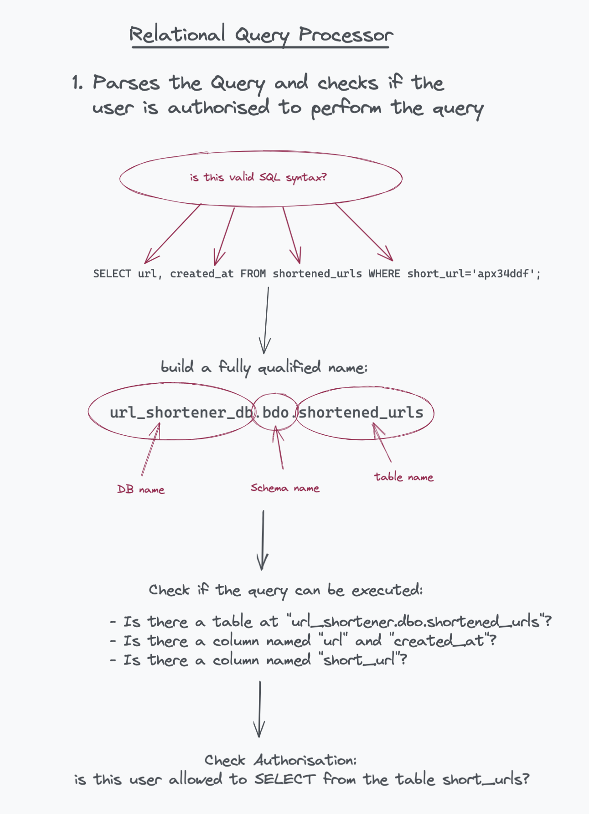

# Architecture of a Database System (pt. 2)

Part 1 was about the overall architecture of the DB and its relationship with the host OS. Here we see in depth the various components of the DB system.

- [1. Relational Query Processor](#1-relational-query-processor)

## 1. Relational Query Processor

A relational query processor job is to:

- take a declarative SQL statement
- validate it
- optimise it into a procedural data flow (query planner)
- execute this plan for the client (worker) who asked for it

### Query Parsing and Authorization

> Given an SQL query, the parser first considers each of the table references in the FROM clause. It canonicalizes table names into a fully qualified name of the form `server.database.schema.table`. This is also called a **four part name**.
>
> Systems that do not support queries spanning multiple servers need only canonicalize to `database.schema.table`, and systems that support only one database per DBMS can canonicalize to just `schema.table`

About **fully qualified names**:

> Fully qualified names are used to avoid the collisions of the names.
> we can have column with the same name in two different table or we can have two tables with the same name in two different databases. So, to avoid the collision and help the sql server to find out the right table and columns, we use fully qualified names.

Read more [here](https://www.tektutorialshub.com/sql-server/fully-qualified-table-names-in-sql-server/)

If the query syntax ("is it valid SQL?") and semantics ("do the tables queried for exist?") are ok, the next step is to ensure the user is **authorised** to perform the `SELECT/DELETE/INSERT/UPDATE` action.

If all is good we go to **query rewrite**

### Query rewrite

The QR, or **rewriter**, simplifies the query without changing its semantics.
The name rewrite is misleading since the query stays the same, what changes is that the internal representation of the query is optimised.

An example:

> The expression `Emp.salary < 75000 AND Emp.salary > 1000000`, for example, can be replaced with `FALSE`. This might allow the system to return an empty query result without accessing the database.

### Query optimiser

Transforms the query into a query plan, which is the procedural series of operations to retrieve or write the data from/to disk.

[This article](https://www.sqlite.org/queryplanner.html) is a concise explanation of SQLite Query planner.

Extra care needs to be taken when reading AND updating at the same time.

> In computing, **the Halloween Problem** refers to a phenomenon in databases in which an update operation causes a change in the physical location of a row, potentially allowing the row to be visited more than once during the operation. This could even cause an infinite loop in some cases where updates continually place the updated record ahead of the scan performing the update operation.
>
> The potential for this database error was first discovered [...] in 1976, on Halloween day while working on a query that was supposed to give a ten percent raise to every employee who earned less than $25,000. This query would run successfully, with no errors, but when finished all the employees in the database earned at least $25,000, because it kept giving them a raise until they reached that level. The expectation was that the query would iterate over each of the employee records with a salary less than $25,000 precisely once. In fact, because even updated records were visible to the query execution engine and so continued to match the query's criteria, salary records were matching multiple times and each time being given a 10% raise until they were all greater than $25,000.

> **We must ensure data is available to the write, which has been fully read**

### Query executor

Receives the query plan and executes it.

Perf metrics for the query executor are:

- time to query completion
- DBMS throughput
- time to first row

