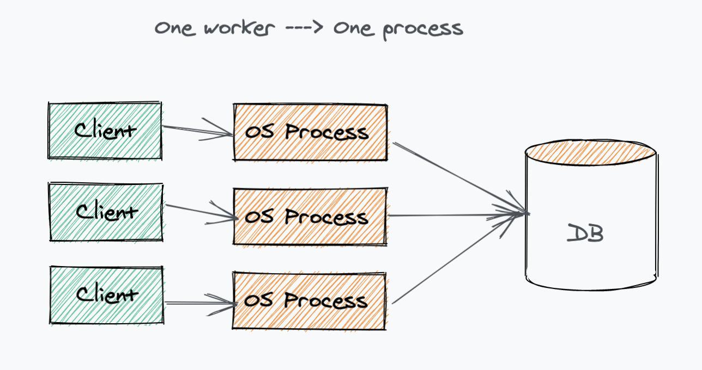
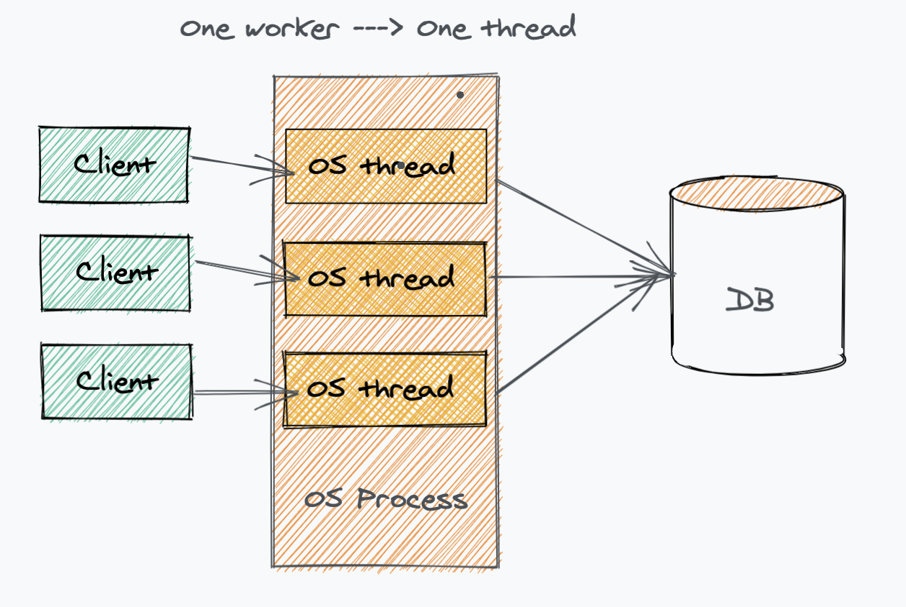
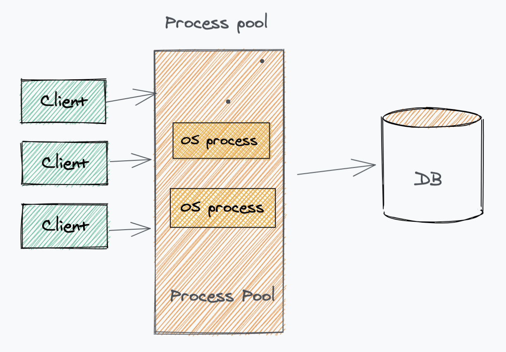

# Architecture of a Database System

From [this paper](https://dsf.berkeley.edu/papers/fntdb07-architecture.pdf), written by Joseph M. Hellerstein, Michael Stonebraker and James Hamilton

Other interesting articles:

- [How to write a DB](https://cstack.github.io/db_tutorial/)
- Writing the worst SQL DB on earth/This is the worst DB on earth and I wrote it

## Life of a query

### 1. The client (like a user's pc) issues a query over the network.

First, a connection needs to be established, so the DBMS needs to be able to communicate in various protocols with different clients. Like, the the PC directly (2-tier communication, or client-server), or a middle tier like a web server (3-tier, or more).
It also needs to be able to **remember** this connection.
Finally, it needs to remember the query itself and be able to transmit it internally.

### 2. Process management

The DBMS needs to assign a **thread of computation** to this query and decide if the operation can be performed now or later (for instance, if there's not enough memory to perform the operation now)

### 3. Relational Query Processor

Connection is established and thread is assigned, it's time to process the query.
The SQL query is compiled into a **query plan**.

```
SQL query --> get translated into --> Query plan
```

The query plan consists of a series of operations such as:

- selection
- join
- projection
- sorting
- etc

More about [query planning here](https://www.sqlite.org/queryplanner.html).

### 4. Transactional Storage Manager

The TSM is the part of the system that is in charge of actually retrieving and writing the data to disk.
It gets the locks from the lock manager to perform operations in safety in regards to other concurrent calls.
It also ensures atomicity of operation, so it is responsible for rolling back partial operations that can't be completed.

### 5. Unwinding of the operations

At this point data is accessed on disk and can be sent back to the client, basically walking backwards in the chain of events we've seen so far. Once the connection is closed the memory is freed and any volatile state is erased.

## Process models

Since a DBMS is normally a **multi-user system**, dealing with **concurrency** is a fundamental piece of functionality and one that influences the design from early stages.

Some terminology first:

- **OS process**: a program execution unit to which the kernel allocates a space in memory. The memory is **private** to that process. A process is an executing instance of a program. In its simple form, 1 program:1 process, but nevertheless, 1 program can spin up more than 1 process. On a multiprocessor system, **multiple processes** can be executed in parallel. On a **uni-processor system**, though true parallelism is not achieved, a process scheduling algorithm is applied and the processor is scheduled to execute each process one at a time **yielding an illusion of concurrency**.
- **OS thread**: a program execution unit that "lives" inside a process. In fact, it's a sub-unit of a process. It has no truly private space and **shares the resources with all the other OS threads in that process**. They are called also **Kernel threads**.
- **Lightweight Thread Package**: an **application level** thread (as opposed to OS level threads, see above). It comprises multiple OS threads in a single process and the Kernel is unaware of it.
- **DBMS Client**: a software that is the link between programs and the DBMS itself, via its API.
- **DBMS Worker**: a thread of execution in the DBMS that is in charge of attending the requests of the **DBMS client**. It's a 1:1 mapping, 1 client, 1 worker.

Read [more](http://web.archive.org/web/20100807021758/http://kquest.co.cc/2010/03/program-process-task-thread)

There are various ways one can map 1 worker to OS threads of processes.
Starting from the simplest scenario of a uni-processor machine there are 3 ways one can design the process model. Simplest to hardest:

1. 1 process per DBMS worker
2. 1 thread per DBMS worker
3. Process pool

### 1 process per DBMS worker



PROs:
- Easier to implement because a lot of the "hard work" about memory management is delegated to the OS

CONs:
- More memory intensive, as processes are heavier than threads
- The data that needs to be shared by multiple processes (like the locks) has to be stored outside of the process, in shared memory spaces given by the OS. As we have seen, each process has **private** space, so it can't share these info, it needs to read it from a shared memory space.

### 1 thread per DBMS worker



Each connection is allocated a new thread. As each client
submits SQL requests, the request is executed entirely by its corresponding thread running a DBMS worker. This thread runs within the
DBMS process and, once complete, the result is returned to the client
and the thread waits on the connection for the next request **from that
same client**.

PROs:
- More memory efficient than the 1st approach

CONs:
- Memory management can be tricky. As we have seen, threads share memory within the same process, so they can race to get the same resources.
- Harder to port across OSes.

### Process pool



Since 1 process x worker is simpler to do, this approach tries to leverage that while limiting its memory footprint.

> A central process holds all DBMS client connections and, as each SQL request comes in from a client, the request is given to one of the processes in the process pool
>
> The SQL Statement is executed through to completion, the result is returned to the database client, and the process is returned to the pool to be allocated to the next request

The pool size is generally fixed.
If no process is free an incoming request must wait for one to become available in the pool again.

## Shared data and process boundaries

All the 3 methods above have in common that **they aim to execute concurrent requests as independently as possible**. Full independence is not possible since they need to share some data like locks or the DB space itself.

Locks are managed by the **lock table**, which resides in a shared memory space.

## Evolution of the process model

Hardware has progressed enormously over the last 3 decades and the process model has evolved to make the most of this change. Process pool for instance has evolved into thread pooling, but at its core the 3 models above still offer a good representation of the fundamentals of today's DBs.
