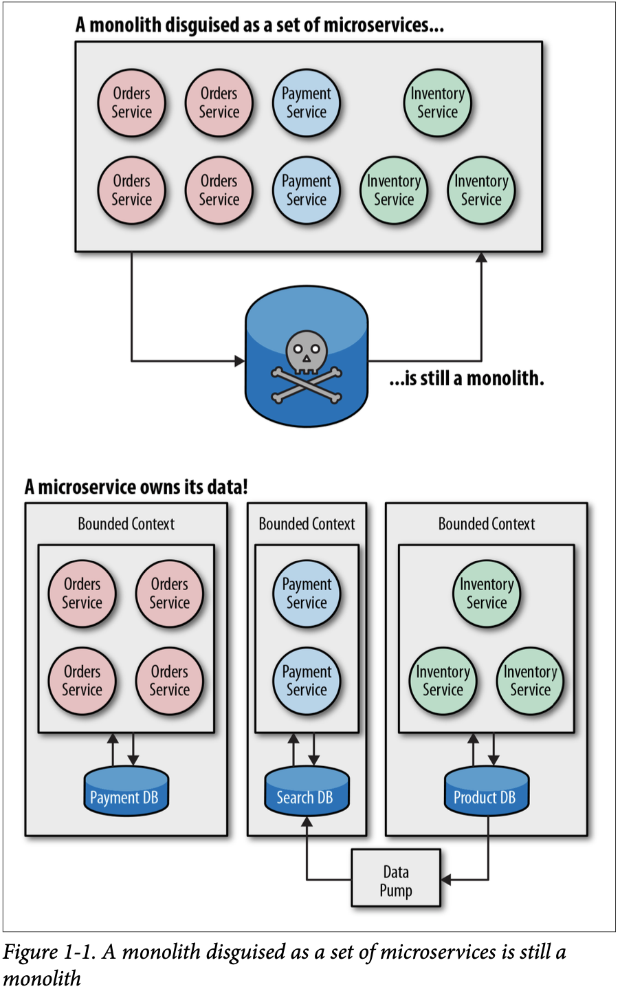
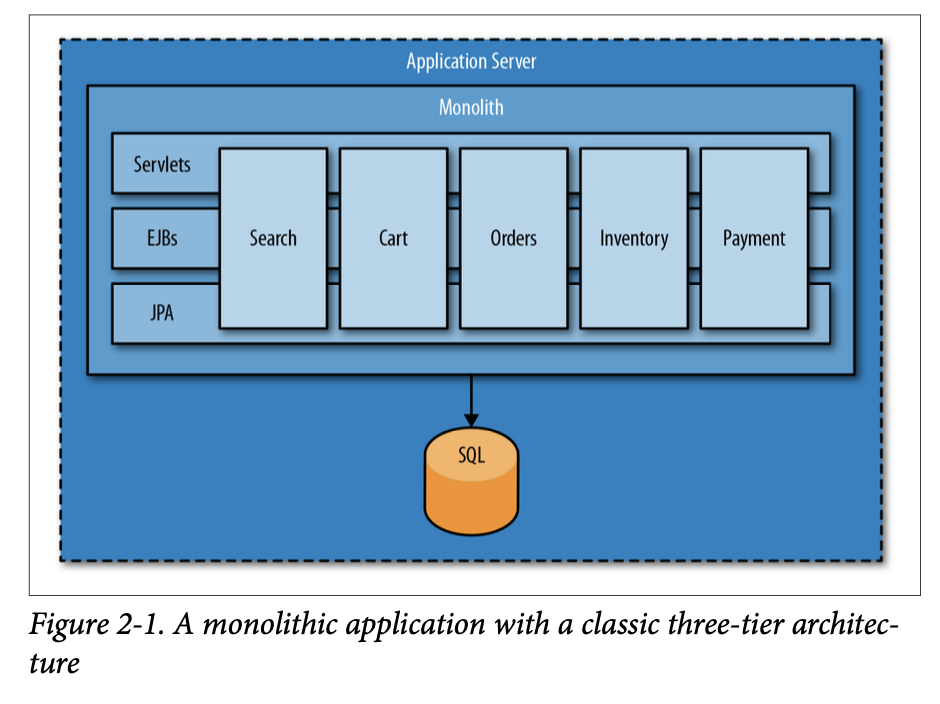
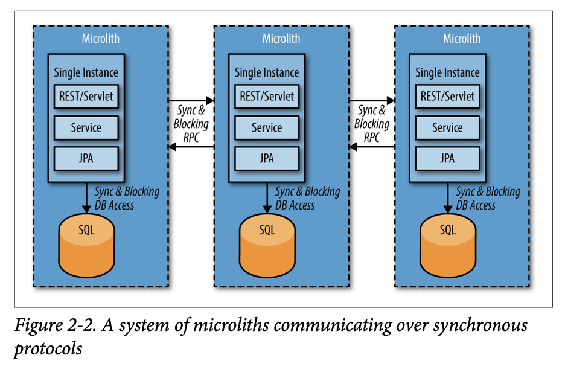

# Reactive Microsystems

Book by Jonas Boner

## Act autonomously

- Microservices allow team to move more independently
- The cost is **complexity**
- The advantage is the fact that you can roll out or replace services faster

**Authonomy** is the keyword, what we are striving for.
Autonomy is the foundation on which we can scale both the system and the development organization.

Systems should be moved around in isolation

## Single Responsiblity Principle

Similar to the Unix phylosophy, a MS should do one thing only.

## To each their own state

MS are for the most part stateful, they hold their own state.

This simple fact has huge implications. It means that data can be strongly consistent only within each service but never between services, for which we need to rely on eventual consistency and abandon transactional semantics. 

> You must give up on the idea of a single database for all your data, normalized data, and joins across services

## Monoliths: how not to break them down

Starting from a typical scenario like this:

Many times an attempted move to micorservice architecture ends up with:

This is **not** a microservice architecture.

> A microlith is defined as a single-instance service in which synchro‐ nous method calls have been turned into synchronous REST calls and blocking database access remains blocking. This creates an architecture that is maintaining the strong coupling we wanted to move away from but with higher latency added by interprocess communication (IPC).

Keywords here are **blocking** and **higher latency**.

The communication between MSs is the hardest part.

> What’s difficult in microservices design is not creating the individ‐ ual services themselves, but managing the space between the serv‐ ices. 

## Looking at the past

> [We need to] come to terms with the fact that information is always from the past, and always represents another present, another view of the world (you are, for example, always seeing the sun as it was 8 minutes and 20 seconds ago). “Now” is in the eye of the beholder, and in a way, we are always looking into the past.
> 
> It’s important to remember that reality is not strongly consistent, but eventually consistent. Everything is relative and there is no single “now.”

How to avoid microliths:

- Events-First Domain-Driven Design
- Reactive Programming and Reactive Systems
- Event-Based Persistence

## Events-First Domain-Driven Design

EF DDD is a set of principles help us to shift the focus from the nouns (the domain objects) to the verbs (the events) in the domain. 

- Think event-first
- Do not be biased by the current structure

> Object-Oriented Programming (OOP) and later Domain-Driven Design (DDD) taught us that we should begin our design sessions focusing on the things—the nouns—in the domain, as a way of finding the Domain Objects, and then work from there. It turns out that this approach has a major flaw: **it forces us to focus on structure too early.****
>
> Instead, we should turn our attention to the things that happen — the flow of events — in our domain. This forces us to understand how change propagates in the system—things like communication patterns, workflow, **figuring out who is talking to whom, who is responsible for what data**, and so on. We need to model the business domain from a data dependency and communication perspective.

> When you start modeling events, it forces you to think about the behavior of the system, as opposed to thinking about structure inside the system.
> Modeling events forces you to have a temporal focus on what’s going on in the system. Time becomes a crucial factor of the system.

Keyword here **"We need to model the business domain from a data dependency and communication perspective."**

## Events represent facts

Events are facts. A fact represents something that has happened in the past.

> Something that truly exists or happens: something that has actual existence, a true piece of information.

Facts are **immutable**. They can’t be changed or be retracted.

We need to focus on the flow of information, rather than on its representation at a point in time. Event Storiming is how we do that.

Domain events are suited to:

- describing the business
- implementing the supporting software

## Event storming

> It’s a design process in which you bring all of the stakeholders—the domain experts and the programmers—into a single room, where they brainstorm using Post-it notes, trying to find the domain lan‐ guage for the events and commands, exploring how they are causally related and the reactions they cause.

- Explore the domain from the perspective of what happens in the system.
- Explore what triggers the events. 
- Agree on the shared terminology, the "Ubiquitous Language"
- Different functions work together at the same time

Example: https://www.youtube.com/watch?v=mLXQIYEwK24

## Inter-service communication

> It is unfortunate that synchronous HTTP (most often using REST) is widely considered as the “state of the art” microservice communi‐ cation protocol. Its synchronous nature introduces strong coupling between the services making it a very bad default protocol for inter‐ service communication. Asynchronous messaging makes a much better default for communication between microservices (or any set of distributed components, for that matter).

- Always apply backpressure. If a service is degrading, it should ask the brokers to reduce their load.
- Prefer async messaging to REST for communication
- REST requires both services to be up and able to interact (ie. not overloaded/degraded)

## How to improve microliths

- Replace REST over HTTPS with async messaging
- Examples are Kafka and AWS Kinesis
- This helps to decouple the services by introducing temporal decoupling — **the services communicating do not need to be available at the same time**

MSs should embrace the fact that data is not always at rest, but it's more and more in motion.
Asynchronicity in cmmunication favours decoupling.

## Scaling persistence

CRUD is most often the wrong way to think about the design of MSs.

>  When bookkeeping was done with clay tablets or paper and ink, accountants developed some clear rules about good accounting practices.
> One never alters the books; if an error is made, it is annotated and a new compensating entry is made in the books. The books are thus a complete history of the transactions of the business.
> Update-in-place strikes many systems designers as a cardinal sin: it vio‐ lates traditional accounting practices that have been observed for hun‐ dreds of years.
>
> —Jim Gray, The Transaction Concept, 1981

Disk space used to be very expensive. This is one of the reasons why most SQL databases are using update-in-place—overwriting existing records with new data as it arrives.
Today disk space is cheap so there is little-to-no reason to use update-in-place for System of Record. 

> We can afford to store all data that has ever been created in a system, giving us the entire history of everything that has ever happened in it.

> The truth is the log. The database is a cache of a subset of the log.
>
> —Pat Helland