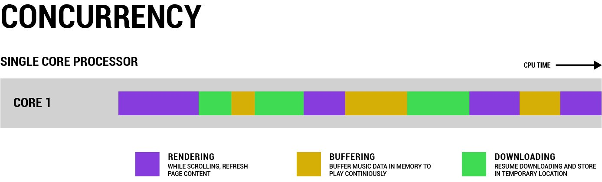
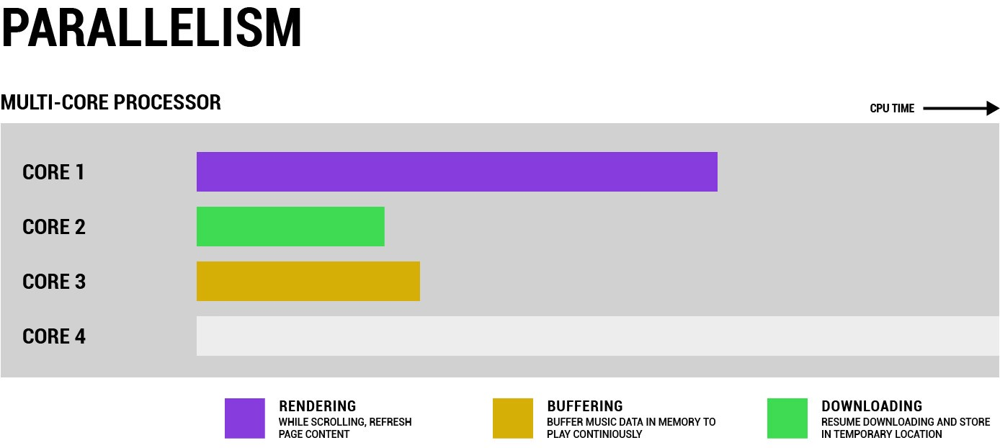
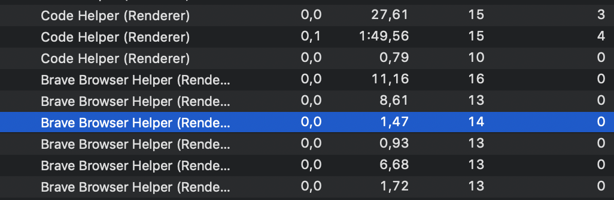

# General Programming

## Concurrency

From [here](https://medium.com/rungo/achieving-concurrency-in-go-3f84cbf870ca)
Ability to deal with multiple tasks at the same time.

A machine with a single CPU core can handle only one thing at a time. To achieve concurrency the CPU Time is split and assigned to the various tasks.
The many tasks that need to be performed at one time are interleaved one another.

The OS prioritises the tasks and make them "appear" simultaneous, but in reality they are split and are executed in consecutive chunks.

## Parallelism

A multi-core pc can instead **execute multiple chunks** at the same, or dedicate each core to a different task.

> While concurrency is dealing with multiple things at once, parallelism is doing multiple things at once.
>
> &mdash; <cite>[source](https://medium.com/rungo/achieving-concurrency-in-go-3f84cbf870ca)</cite>

## What is a computer process

When we write a program the end result is just a text file. For a computer to understand the operations described into it this file needs to be converted (compiled) to machine code (binary).
That's the role of the compiler (in compiled languages, such a C and Java) or the one of the interpreter (for interpreted languages, such as Js and Ruby).

When the program is then executed the machine allocates memory to handle it and assigns it a **process ID**.
A process has at least one thread, the main thread. When the main thread is done with its execution, the process exits.

## What is a thread

A thread is a lightweight process inside a process, and it's the actual executor of a program. While running, a thread stores variables in a **fixed-size** portion of memory, the **stack**. The stack will only be accessible by that thread, another portion of memory, the **heap**, is shared with other threads.

## Examples

When we start a browser, some code is executed and that spins up a new process. That process can in turn ask the OS to spin up another process so a new tab can be created and run. That tab needs to be able to support different activities at the same time, like scrolling (one thread), playing a video (another thread), render a popup (another thread).

This is **multi-threading**. If we open Activity Monitor we will see that each application runs multiple processes, and each process spawns one or more threads.

## Thread scheduling

Multiple threads running in series (concurrency) or in parallel (parallelism) may need to access the same portion of data in memory. To do so there needs to be a way to orchestrate and regulate this access. This is **scheduling**.

Multiple threads accessing the same portion of data at the same time may run into race conditions.
