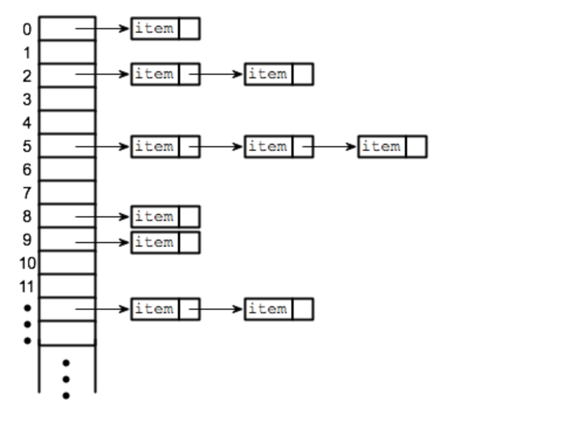

# Hash tables

## Resources

- [Basics of Hash Tables](https://www.hackerearth.com/de/practice/data-structures/hash-tables/basics-of-hash-tables/tutorial/)
- [Video on hash tables and collision resolution](https://www.youtube.com/watch?v=MfhjkfocRR0)

## Explanation

The idea of hashing is to distribute entries (key/value pairs) uniformly across an array.
So, an **array** is at the base of a hash table implementation.

Each element is assigned a key (converted key). By using that key you can access the element in **O(1) time**.

There are 2 steps to hashing:

1. The key is converted into an integer by using the **hash function**
2. The element is stored in a slot of the array

The operation looks like this:

```
hash = hash_function(key)
index = hash % array_size
```

So the array size doesn't matter when computing the hash. Once we need to map the hash to an index in the array where the data will be stored we use the modulo operator, so the hash is actually applied to fit the length of the array.

## Hash Function

To achieve a good hashing mechanism, It is important to have a good hash function with the following basic requirements:

- Easy to compute: It should be easy to compute.

- Uniform distribution: It should provide a uniform distribution across the hash table and should not result in clustering (this would decrease perf when collisions occur)

- Less collisions: Collisions occur when different elements are mapped to the same hash value. These should be avoided.

Note: Irrespective of how good a hash function is, collisions are bound to occur. Therefore, to maintain the performance of a hash table, it is important to manage collisions through various collision resolution techniques.

## Collisions

See [this video](https://www.youtube.com/watch?v=MfhjkfocRR0&list=PLTxllHdfUq4f7-uHOpxXnBUbsuLiI9pmb&index=1)

When 2 keys hash to the same index a collision happens.

One method of dealing with it is to store a linked list instead of the element when placing data at the array index.

