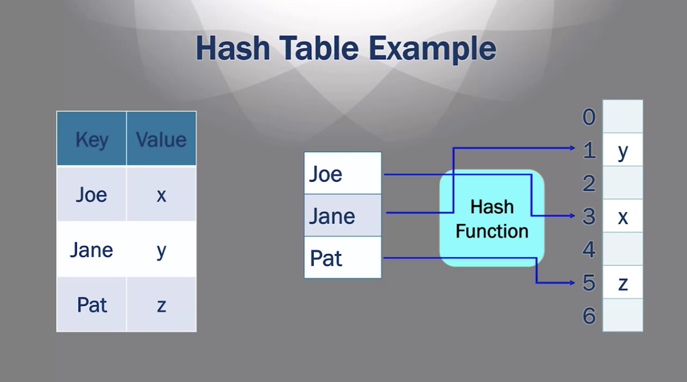

# Go

- compiled
- automatically memory management (garbage collection)
- OOP
- does not have the concept of class

## Structs

Instead of `class`es Go has `struct`s.
The are similar, but with some key limitation:

- no inheritance
- no constructors
- no generics

## Concurrency

Moore's law says that the number of transistors doubles every 18 months.
This meant that computers have been getting consistently faster every year. This used to be tru, but reality is now different. The development has hit limitations such as power/temperature constraints.
Heat is one major road block, since transistors risk melting as temperatures increase.

A solution to this has been increasing the number of cores. Multiple cores means that different tasks can be performed on the same machine at the same time (parallelism).
Parallelism is inherently hard. Some question arise:

- when do tasks start/stop?
- what if one task need data from another parallel task?
- how do they handle conflicts in memory. For ex. how do we make sure that one process writing to variable A does not conflict to another process writing to variable A?

Concurrency is key for large systems, and Go has primitives for it:

- **goroutines**: concurrent tasks
- **channels**: used to communicate between tasks
- **select**: to handle task synchronisation

## Workspaces

All go files are stored in workspaces, with a predefined hierarchy of directories.
This convention favors sharing code, which is one of the most important points in Go.

Workspaces are divided in 3 subdirectories:

- **src**: for source code
- **pkg**: for libs
- **bin**: for executables

The unique workspace directory is defined by the `GOPATH` environment variable.
This is set automatically on installation.
The default one should be:

```sh
~/go
```

All go tools assume the Go code is inside `GOPATH`.

## Packages

The first line of each file gives the name to the package.

```go
package dateutils
```

```go
package currencyutils
```

These will be imported like so:

```go
import (
  "dateutils"
  "currencyutils"
)
```

Execution starts on package `main`, which is required.
Upon compilation this file will be the one that will be turned into the executable.
The main package needs a function called `main`.

```go
package main
import "fmt"

func main() {
  fmt.Printf("hello")
}
```

## [Go Tool](https://www.coursera.org/learn/golang-getting-started/lecture/09AcC/m1-2-3-go-tool)

Go tool is downloaded with Go itself and includes a series of commands:

- **`go build`**: compiles the program.
- **`go fmt`**: formats code
- **`go get`**: package manager
- **`go run`**: compiles go files and runs the executable
- **`go test`**: runs tests

## [Variables](https://www.coursera.org/learn/golang-getting-started/lecture/dQajs/m1-3-1-variables)

- case sensitive
- keywords are forbidden
- need a type declaration

```go
var x int
```

The type defines which values a variable accepts and which operations this variable supports.
For ex. if a variable is an integer it will support addition, division etc.

Variable types are initialised on declaration. Type can also be inferred, although it's always preferable to be explicit

```go
var age int = 22
var height = 177 // int is inferred
```

Values can be assigned to variables after declaration:

```go
var age int
age = 22
```

Unitialised variables are automatically assigned the "zero" value of that type:

```go
var age int // 0
var name string // ""
```

Variables can also be declared and initialised via **short variable declaration**:

```go
age := 22
```

Type is inferred from the right hand side. Short variable declarations can only be used **inside** functions.

## Data types

### [Pointers](https://www.coursera.org/learn/golang-getting-started/lecture/uYnqu/m2-1-1-pointers)

A pointer is an address to some data in memory. 2 operators are associated with pointers:

1.  `&`: returns the address of a variable/function
2.  `*`: returns data at an address (dereferencing)

So they are the opposite of one another.

```go
var x int = 1
var y int
var p *int // p is a pointer to an integer (any integer)

p = &x // take the address in memory where the value 1 is stored and assign this reference to p
y = *p // take the value that p references to and assign it to y
```

Go is **strongly typed**, so we can't assign a value of another type to an initialised variable.

```go
func main() {
  stuff := 'stuff'
  stuff := 23 // Error
}

```

### New

New is a function, used to create a variable and return a pointer to that variable.
The variable is initialised to 0.

```go
num := new(int)
*num = 1 // set the value of that integer
```

## [Deallocating memory](https://www.coursera.org/learn/golang-getting-started/lecture/S9VsN/m2-1-3-deallocating-memory)

Just like when claiming memory space to store variable data, we then need to deallocate it in order to free memory and avoid running out of memory.

In the example below if we call `stuff` a thousand times, memory space to store `x` will be allocated once for each invocation.

```go
func stuff() {
  var x int = 3
  fmt.Printf("%d", x)
}
```

To understand how memory space is claimed and freed we need to consider 2 parts that form the memory as a whole, ie the **stack** and the **heap**.

### Stack

The stack is an area of memory that is primarily dedicated to **function calls**.
One of the things is stored in the stack are the **local variables** for a function. So every time you call a function there can be variables that you define in that function and generally they go into the stack.

```go
func stuff() {
  var x int = 3 // this will be stored in the STACK
  fmt.Printf("%d", x)
}
```

Once the function finishes executing, the space in memory is automatically reclaimed.

### Heap

Object stored in the heap on the other hand are - **in many compiled languages, like C** - not garbage collected automatically. You will have to manually do it. This makes the language very fast, but also more error-prone.

```go
var x int = 3 // this will be stored in the HEAP
func stuff() {
  fmt.Printf("%d", x)
}
```

Interpreted languages do that for you. This is safer, but slower.
**Go** is different. While being compiled, it has garbage collection baked in.
This was a conscious decision and a tradeoff between speed and safety/DX. Memory management is very hard if done manually.

## Printing

```go
fmt.Printf("Hi %s", n) // where n is a string
```

## Integers

Generic integer declaration

```go
var x int = 3
```

We can be more specific with the type if needed:

```go
// signed integers
int8 // 0 -> 255
int16
int32
int64
// unsigned
uint8
uint16
uint32
uint64
```

Unsigned ints can be bigger since the memory space used for the sign is not needed in their case. Declaring as `int` is safer, we delegate to the compiler to infer the most suitable type.

## Type conversion

In general, binary operations (like =, +, - etc), require the two operands to be of **the same type**. This is not always possible.

```go
var x int8 = 3
var y int16 = 7
y = x // this not possible, types are different
```

To convert Go provides a method for each type, `T()` where `T` is the type we want to get:

```go
y = int16(x)
```

## Strings

Strings are a sequence of bytes that have to be encoded using a standardised code.
**ASCII** was the first commonly accepted one. Each character is associated to an 8-bit code.
This means that a max number of 256 (8-bit goes from 0 to 255) can be represented. This is fine for a "simple" alphabet like the English one, but is insufficient to represent more complex ones, like Chinese.

That's the problem that **Unicode** aims to solve. A Unicode character is 32-bits long.

**UTF-8** is a subset of Unicode that has variable length characters, it has 8-bit chars but can go up to 32.
The 8-bit chars **match the ones encoded with ASCII**, but to represent other characters it uses either 16 or 32 bits.

Strings are immutable. UTF-8 is Go's default.

## Constants

Values that are known at compile time.

### Iota

When you a set of discrete values that you want to keep distinct but don't care too much about the value itself, as long as it's different from all the others in the set.
For ex., you want to represent the days of the week. In this case you don't care about the way "Monday" is stored in memory (it can be 1, it can be 0, it can be 11292), as long as this value is _different_ from the representation of "Tuesday" or any other day.

```go
type Day int
const (
  Mon Day = iota
  Tue
  Wed
  Thu
  Fri
  Sat
  Sun
)
```

As you see above, you only need to specify the first entry's type and assignment. The rest is done automatically. Value assignment starts at 1 and increases progressively. In this case Monday is 1, Tuesday is 2 etc. Having said that **you should not depend on this value**, that's not the idea of iota.

## Code flow

### For loops

```go
for i := 0; i<10; i++ {
  // .. do stuff
}

// same as
i = 0
for i < 10 {
  // do stuff
  i++
}
// ^ this is a while loop, in other languages
```

## Switch

```go
switch x { // <== tag
  case "next":
    // do next
  case "prev":
    // do prev
  default:
    // default case
}
```

Note that unlike other lang, you don't need a `break`.

### Tagless switch

```go
switch { // <== notice, no tag
  case x > 1:
    // do stuff
  case x < 1:
    // do other stuff
  default:
    // base
}
```

## Scan

Reads user input, takes a pointer as argument.
Data is then written to the pointer.
Returns the number of scanned items.

```go
var name string

fmt.Printf("Insert your name")
_, err := fmt.Scan(&name)

fmt.Printf(name)
```

### Exercise 2.1

Write a program which prompts the user to enter a floating point number and prints the integer which is a truncated version of the floating point number that was entered. Truncation is the process of removing the digits to the right of the decimal place.

```go
package main

import (
	"fmt"
	"log"
	"strconv"
)

var resp string

func read() {
	fmt.Printf("Please type a float\n")
	fmt.Printf("Type \"exit\" to close\n")
	_, err := fmt.Scan(&resp)
	if err != nil {
		fmt.Println(err)
		log.Fatal(err)
	}
	if resp != "exit" {
		num, err := strconv.ParseFloat(resp, 64)
		if err != nil {
			fmt.Println(err)
			log.Fatal(err)
		}
		fmt.Printf("Here's your result: %d\n", int(num))
		read()
	}
}
func main() {
	read()
}
```

### Exercise 2.2

Write a program which prompts the user to enter a string. The program searches through the entered string for the characters ‘i’, ‘a’, and ‘n’. The program should print “Found!” if the entered string starts with the character ‘i’, ends with the character ‘n’, and contains the character ‘a’. The program should print “Not Found!” otherwise. The program should not be case-sensitive, so it does not matter if the characters are upper-case or lower-case.

Examples: The program should print “Found!” for the following example entered strings, “ian”, “Ian”, “iuiygaygn”, “I d skd a efju N”. The program should print “Not Found!” for the following strings, “ihhhhhn”, “ina”, “xian”.

```go
package main

import (
	"fmt"
	"os"
	"strings"
)

var startsWith string = "i"
var endsWith string = "n"
var contains string = "a"

func parse() {
	var str string

	fmt.Printf("Please type a string here below:\n")
	_, err := fmt.Scan(&str)

	if err != nil {
		os.Exit(1)
	}

	var lower string = strings.ToLower(str)

	if lower == "exit" {
		return
	}

	var found bool = strings.HasPrefix(lower, startsWith) &&
		strings.HasSuffix(lower, endsWith) &&
		strings.Contains(lower, contains)

	if found == true {
		fmt.Printf("Found!\n")
	} else {
		fmt.Printf("Not found!\n")
	}

	parse()

}
func main() {
	parse()
}
```

## Part 3. Composite Data Types

## Arrays

- Fixed size
- Index start at 0
- Elements ar ealways initialised to the 0 value of that data type ( `int` => `0`, `string` => `""`, etc.)

```go
var names [3]string

names[0] = "Sia"
fmt.Printf("%v", names[1]) // ""

```

## Array literal

- Array with predefined values, an initalised array

```go
var names [2]string = [2]{"Aurora", "Grace"} // size is explicit
// or
names := [...]string{"Kyle", "Rania"} // here the size is inferred
```

### Iterators: For loops

```go
vals := [...]int{10, 20, 30}

for i, val := range vals {
  fmt.Printf("Index: %d, Value: %v\n", i, val)
}
```

## Slices

- Portions of arrays
- Unlike arrays, slices are of **Variable size**

They have 3 props:

- pointer: start of the slice, the 1st element in the array
- length
- capacity (max number of items it can contain)

```go
arr := [...]string{"Johm", "Stefan", "Paul", "Nicholas"}
people1 := arr[0:1] // {"John"}
people2 := arr[1:3] // {"Stefan", "Paul", "Nicholas"}}

len(people1) // length is 1 (it only has 1 element)
cap(people1) // capacity 4 (that's the length of the array it refers to)
```

Slices **refer** to the original array, so if you mutate one element within a slice, the original and all the slices that contains that item will reflect the new value as well.

Slices can also be literal:

```go
// slice literal
arr := []string{"Johm", "Stefan", "Paul", "Nicholas"}
// notice the difference with an array
arr := [...]string{"Johm", "Stefan", "Paul", "Nicholas"}
```

A post on differences between slices and arrays can be read [here](https://www.sohamkamani.com/blog/golang/arrays-vs-slices/).

Slices can be created also by using `make()`:

```go
make([]string, 3) // slice of strings, length and capacity of 3
// or
make([]string, 10, 15) // slice of strings, length of 10, capacity of 15
```

Whenever we instantiate a slice, Go will instantiate an array and slice it for us.

New elements can be added to the end of the slice. If the capacity is not enough Go will handle this case for us and instantiate a new array with the required length.

```go
slice1 = make([]string, 0, 5)
slice2 = append(slice1, 'hi')
```

## Hash Tables

- contains key/value pairs
- a hash function is used to compute the slot in memory for each key

The hash function is nor called directly, this goes on behind the scenes.
One can think at a hash table as an array (in memory). Instead of using integers as keys a user picks strings as keys. Still, Go has to map those strings to integers to be used as indices of the items in the array. This mapping is the task of the **hash function**.



### Pros of hash tables

A hash table is convenient because it has constant lookup time.
A list - on the other hand - has linear lookup time. The bigger the list, the longer it will take to find the location of the value we want, because to scan we have to start from 0 and then go up to the last element in the list (worst case scenario).

### Cons of hash tables

The hash function might bump into collisions, ie 2 keys can be directed to the same index.
This is very rare and unlikely to happen.

A collision happens when two different keys are hashed to the same output.

```
H(a) = H(b)
and
a != b
```

Every hash function with more possible inputs than outputs is guaranteed to have at least one collision.

---

Possible expansion on this:

- how to has functions deal with collisions?

---

## Maps

Maps are Go's implementation of **hash tables**.

```go
var idMap map[string]int
// or
idMap = make(map[string]int)

// or using a map literal
idMap := map[string]int {
  "Mark": 12211,
	"Sue": 444234,
}

// adding a key/val
idMap["Jim"] = 22988

// deleting a key/val
delete(idMap, "Mark")

// Two value assignment checks for existence on
idMap := map[string]int{
	"Jane": 233}
_, p := idMap["Jane"]
fmt.Printf("%v", p)
// true
```

One can also iterate through a map:

```go
for key, val := range idMap {
	fmt.Printf("%v => %v", key, val)
}
```

## Structs

Structs group together objects of different data types.

```go
type User struct {
	firstName string
	lastName string
	age int
}
```

Structs can be initialised with `new`. Undeclared values will be 0 (the zero value of that data type):

```go
u1 := new(User)
fmt.Printf("%v", u1.age)
// 0
```

They can also be instantiated by using a struct literal

```go
u2 := User{firstName: "Alfred"}
fmt.Printf("%v", u2.firstName)
// Alfred
```

## Exercise 3.1

Write a program which prompts the user to enter integers and stores the integers in a sorted slice. The program should be written as a loop. Before entering the loop, the program should create an empty integer slice of size (length) 3. During each pass through the loop, the program prompts the user to enter an integer to be added to the slice. The program adds the integer to the slice, sorts the slice, and prints the contents of the slice in sorted order. The slice must grow in size to accommodate any number of integers which the user decides to enter. The program should only quit (exiting the loop) when the user enters the character ‘X’ instead of an integer.

Submit your source code for the program, “slice.go”.

```go
package main

import (
	"fmt"
	"log"
	"sort"
	"strconv"
	"strings"
)

var resp string

func start() {
	store := make([]int, 0, 3)
	for {
		fmt.Printf("%v\n", store)
		fmt.Printf("Please enter a number\n")
		fmt.Printf("Enter x to exit.\n")
		_, err := fmt.Scan(&resp)
		if err != nil {
			log.Fatal("error")
		}

		// X or x will terminate the program
		if strings.ToLower(resp) == "x" {
			fmt.Printf("Bye\n")
			break
		}

		num, err := strconv.Atoi(resp)
		if err != nil {
			log.Fatal("error")
		}
		store = append(store, num)
		sort.Ints(store)
		fmt.Printf("%v\n", store)
	}
}

func main() {
	start()
}
```

## Exercise 3.2
