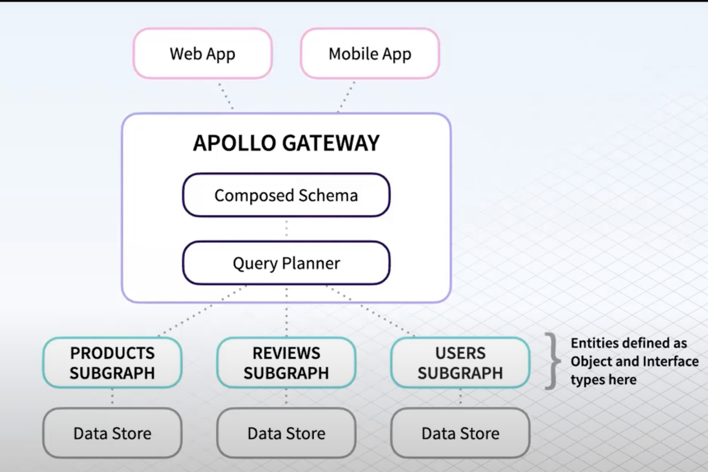

# Federation

From [this video](https://www.youtube.com/watch?v=xYb32CFsY8U).

Entities and subgraphs



Federation allows to separate concerns and enable domain teams.
Everything starts by defining entities.

NOTE: while Type and Entities overlap sometimes, there is a difference between them.

### Key Differences:

- **Abstract vs. Concrete**: A GraphQL type is an abstract definition of the shape of data, while an entity is a concrete instance of data in a database or domain model.
- **Purpose**: Types are used to define the schema and structure of data in GraphQL, while entities represent actual data stored in a system.
- **Data Binding**: Types are not necessarily tied to any data storage mechanism, whereas *entities are often directly tied to a database or other persistent storage systems*.

Read a more extensive description [here](./entity-vs-type.md)

To designate an entity, we need to add the `@key` keyword to the type def.

```gql
## Books subgraph
type Book @key(fields: "ean") {
    ean: String! 
    title: String!
    nPages: Int
    authors: [Author]
}
```

- The `@key` is the primary key of this entity
- Other subgraphs will need to know this key to reference and retrieve the entity

Once we define an entity, other subgraphs can reference it.

```gql
## Reviews subgraph
type Rating @key {
    stars: Int
    book: Book
}

# this is a stub of the Book entity that is defined 
# in another subgraph. It will automatically inherit all the 
# attributes of that entity that are defined in that (and other)
# subgraphs
extend type Book @key(fields: "ean") {
    ean: String! @external
}
```

Now, the reviews subgraph can extend the `Book` entity with the attributes that it knows about.


```gql
extend type Book @key(fields: "ean") {
    ean: String! @external
    ratings: [Rating]
}
```

**Notice how the ratings are added to the Book entity within the Rating subgraph. This is because it's responsibility of that domain to extend the other models with their own slice of the data**.

Also, the Ratings subgraph has direct access to its data, so it can resolve it directly.

*It is important to plan where subgraph boundaries are, based on the domains entities that build up the full landscape.*

## Designing a schema: consult client early on

- Rather than just asking for feedback on a schema proposal, ask them what data they need to render a particular view
- Aggregate all the feedback and use it to design the schema
- Make sure that your schema doesn't leak implementation details (no `linkedFrom`). Expose a natural schema that represents the entities in a straightforward, system independent way

## Establish standards

1. Aim for a consistent naming across graphs.

```gql
❌
query {
    user {
        ...
    }

    getProducts {
       ...
    }
}

✅
query {
    user {
        ...
    }

    products {
       ...    
    }
}
```

2. Design fields for specific use cases

Instead of trying to serve multiple clients with a generic query that "rules them all":

- define domain entities
- write queries that allow to access those entities with very specific arguments/use cases in mind

```gql
"""
❌ too generic, the args cannot be made non-nullable
"""
query {
    book(ean: String!, author: Author): Book
}
"""
✅ every use case is catered specifically and provided with a terser interface
"""
query {
    bookByEan(ean: String!): Book
    bookByAuthor(author: Author): Book
}
```

The same goes for mutations

```gql
type Mutation {
    setAuthor(authorId: String!): Book
    setPrice(price: Price!): Book
}
```

3. Document types, fields and args

All fields that can be described, should be described.

4. Have a strategy for deprecations

There should be a company-wide strategy for versioning and breaking changes.

- Use `@deprecated`
```gql
type Mutation {
    setAuthor(authorId: String!): Book
    setAUthors(authorId: String!): Book @deprecated(reason: "Use the set Author query")
}
```
- use observabiity to know if anyone is still using a field. You should have a way to know when a field is used, and by whom

5. Manage cross-cutting concerns

In some cases, entities and definitions might not clearly belong to one specific domain, but be a cross cutting vaule type.

For instance, you might have 4 subgraphs, and each of them has some form of pagination. In that case, the definition of the type has to a common one.

```gql
type PageData {
    nPages: Int!
    hasNext: Boolean!
    hasPrev: Boolean!
    cursor: Int!
}
```

- These values are effectively duplicated across graphs
- The user has to enforce this consistency, Apollo doesn't help with that for now


