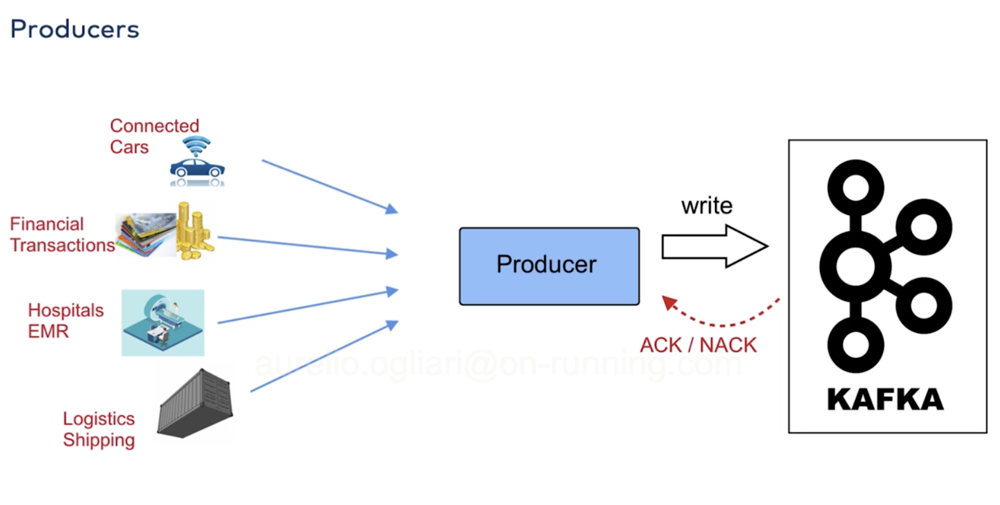

# Kafka Fundamentals

- [video course link](https://training.confluent.io/learningpath-viewer/3292/1/161265/16)
- [Kafka resources and videos](https://kafka.apache.org/videos#applications_use_cases)

## Use cases

In IT we are seeing a shift from dealing with snapshots of state to streams of events. Kafka is very suited for that.
Kafka's job is to manage and process those events.

## Fundamentals

Kafka is a Java application deployed on a cluster.

> In distributed computing, identical workloads or services run on different computers but present themselves to the developer as a single system. Why would that be useful? 
> 
> Well, say that you go to the library and want to check out a book, like I <3 Logs. Unfortunately, your local library is hosting a fundraising event, and is closed to patrons! Luckily, you can head over to the other side of town, and request a copy of that same resource. Distributed computing solves problems in a similar way: if one computer has a problem, other computers in the group can pick up the slack. A distributed computer system can also easily handle more load by transparently integrating more computers into the system. 
> 
> Apache Kafka® is more than a data streaming technology; it’s also an example of a distributed computing system. 
> 
> Within the context of Kafka, a cluster is a group of servers working together for three reasons: speed (low latency), durability, and scalability. Several data streams can be processed by separate servers, which decreases the latency of data delivery. Data is replicated across multiple servers, so if one fails, another server has the data backed up, ensuring stability - meaning data durability and availability. Kafka also balances the load across multiple servers to provide scalability.

[Source](https://www.confluent.io/blog/what-is-an-apache-kafka-cluster/)

To get data into a Kafka cluster, you need a **producer**.
A producer is the application that you write.

The producer is the thing that reads the events emitted from various systems and takes care of writing to the KC (Kafka Cluster). Once written, Kafka sends and Acknowledgement to the producer and it moves on.

### What's in a KC?

A KC is made of **Brokers**.
Brokers are servers (or machines, or VMs... it depends, and for now, it doesn't matter), each with its own Kafka process, its own disk, but they are in the same network, and they operate together within the cluster.

Brokers are effectively infra that is hidden to us most of the times, especially in fully managed services.

### Consumers
The other side of the scope, we have **consumers**, whose job is to read data out of Kafka and distribute it to other services, like processors, dashboards, analytics.

A consumer can also be a producer, because it could send these events in a different place in Kafka.

- Consumers and producers are decoupled. They don't know about each other.
- When a producer is writing an event it never writes it to a consumer, but rather to specific locaiton in the KC, which is called a **topic**. We say, we *produce data to a topic*.

The nice thing is that consumers can be added at any time. They can start reading events that have been existing for a long time.

### Topics

A topic is a collection of events.
You can have many producers writing to a topic, and many producers writing to a topic.
You can have infinite topics.

A topic can also be seen as a log that is stored on disk (remember the disk on brokers).
Consuming a log doesn't destroy it, the log can be re-consumed later or by other consumers.
The series of log is a **stream**

### Structure of a Kafka Message

A Kafka Message is called a **record** and is composed of:

- optional headers
- a key (can a string, an int, can also be an object)
- a value (can be any structure, serialised)
- a timestamp

### Brokers

Brokers manage replication too. Since each broker contains data, it has to make sure that it doesn't get lost in case of problems to the broker itself.
When data is written it is written to a **leader**, and then replicated to its **followers** or replicas.

The number of replicas is configurable and it is generally 3.

### Produces and consumers

- They can be written in any language
- There is also a command line tool for testing producers and consumers, `kafka-console-consumer` and `kafka-console-producer`
