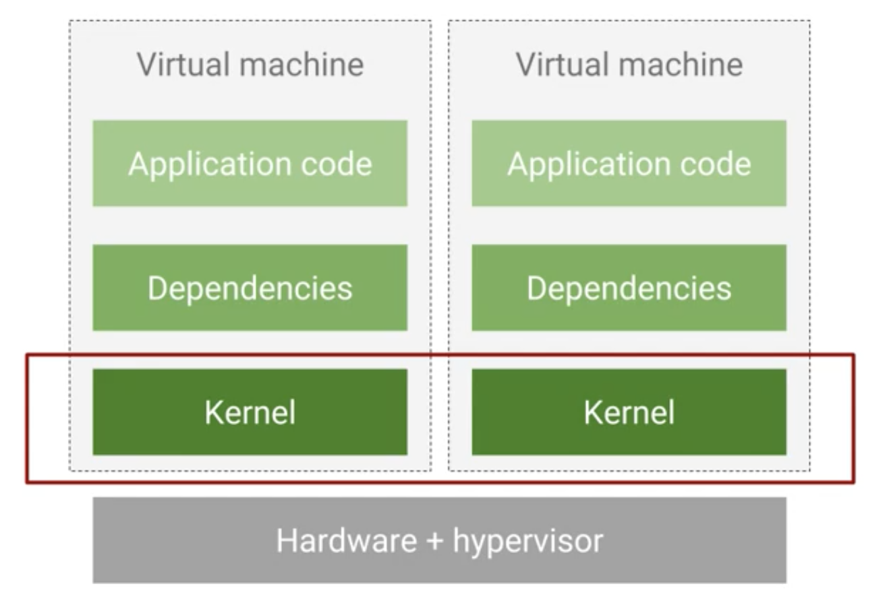
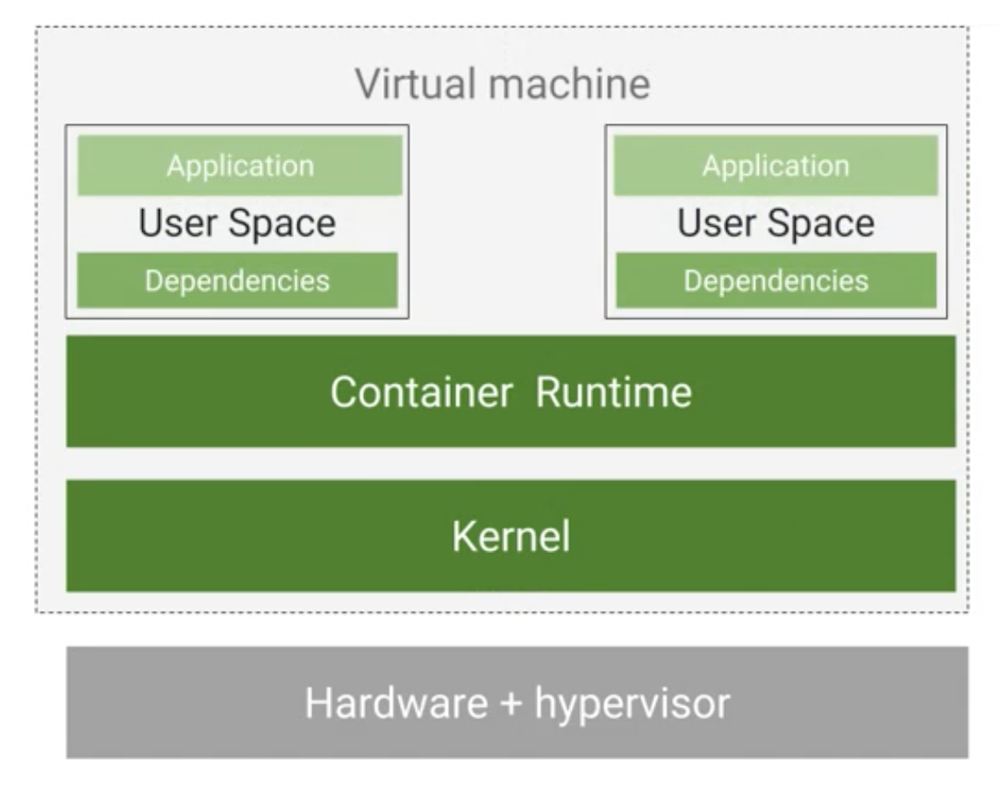

.# Architecting with Google Kubernetes Engine

From this [course](https://app.pluralsight.com/player?course=architecting-google-kubernetes-engine-foundations&author=google-cloud&name=ee573538-7487-4b59-a338-c27fbd55fa14&clip=0&mode=live).

Kubernetes is **a software layer that sits between an application and the hardware infra**.
This abstraction layer makes managing the application easer.

## Cloud computing

- On demand: no human interaction needed to access resources
- Access from anywhere
- Providers set up a pool of resources and allocate chunks of it to the various customers
- Can scale up or down

## GCP solutions

### Compute Engine

Google's IaaS solution. You manage the server instance yourself.

### Kubernetes Engine (GKE)

Run cointainerised applications managed by Google and administered by yourself. You package your code in containers and Kubernetes operates as the orchestrator.

### App Engine

GCP PaaS. Run code in the cloud without worrying about the infra.
Google provisions and manages resources.

### Cloud Functions

Google's Lambda.

## Regions and zones

The World is divided in 3 multi-regional areas.

- America
- Europe
- Asia/Pacific

Every region is the divided into regions, which are independent geographic areas within the same continent.
Within a region there's fast network latency.
Every region is divided into zones, which are deployment areas. A zone is, in practice, a **datacenter** (although this is a simplification since 1:1 mapping zone:datacenter is not always guaranteed).

Deploying across multiple zones enables **fault tolerance** and **high availability**.

### Using and organising regions and zones

A project organises how resources and services are deployed.
Projects can be grouped into folders. A folder mirrors the structure of a company.
For instance:

```
              _______
              FOLDERS

 Department A        Department B
      |                    |
  |-------|            |-------|
  |       |            |       |
Team 1  Team 2       Team 3  Team 4
  |                            |
  |           ________         |
  |           PROJECTS         |
  |                            |
 App            Test Env  ---------- Production
                                        |
              _________                 |
              RESOURCES                 |
                                        |
                                -----------------
                                |       |       |
                              App      GKE    Cloud
                            Engine           Storage
                                              Bucket
```

An organistation owns all the folders. You can set policies that apply to all folders/projects.

## Billing

When you define a GCP project you link a billing account to it.
A billing account can be linked to more projects.
One can also create subaccounts and then separate the billing, so you can for instance re-sell the service and manage the billing part transparently.

---

## Exercise #1

See [here](https://googlepluralsight.qwiklabs.com/focuses/40224).

- An IAM service account is a special type of Google account that belongs to an application or a virtual machine, instead of to an individual end user.

---

## From on premise to containers

### On Premise

Initially the default way of deploying an application was on its own physical computer.
This meant finding physical space, setting it up with power, cooling, network connectivity, install an OS, the dependencies and finally the app itself.

Every upgrade to the infra (more power, more security) meant more computers needed to be added.
This was not scalable nor portable. Apps were often built to run on a specific OS or even a specific hardware.

That's the problem that **virtualisation** solved.

### Virtualisation

Run multiple virtual servers on one physical machine.

> The **hypervisor** is the software layer that allows multiple VMs to share the same hardware.

KVM is one of them.

**Review** and see more [here](https://app.pluralsight.com/course-player?clipId=513e867e-0e0c-4996-af68-be6a9bdcdf19)

While this is better, it can still be problematic to run multiple VMs on one shared machine.



Here above, we run a dedicated VM for each application.
This is better but scales poorly when you have many apps. Doing a kernel update is time-consuming. They are also slow to start because an entire OS has to boot.

This is where containers come into play.

### Containers



Through an abstraction layer we use only one OS.
Containers are user spaces to run application code.
They are lightweight because they don't carry a full OS
They are faster because you don't restart a full OS, but just the underlying process that run them.

> **Image**: an application and its dependencies

A container is a running instance of this image.

---

## Exercise #2: working with Cloud Build

Cloud build is the CI solution of GCP.
[Link](https://googlepluralsight.qwiklabs.com/focuses/40222)

---

## Kubernetes

Manages the containers of an application.
One of the big pluses of K8s is that it is easily portable. It avoids vendor lock in (you can move from AWS to GCP easily, in theory at least)

## GKE Google Kubernetes Engine

- Fully managed K8s

Managed Kubernetes offering from GCP.

## Compute Engine

- Run VMs
- Complete control over the infra

## App Engine

- Fully managed
- Code first, zero config, zero management
- Integrated monitoring, logging and diagnostic
