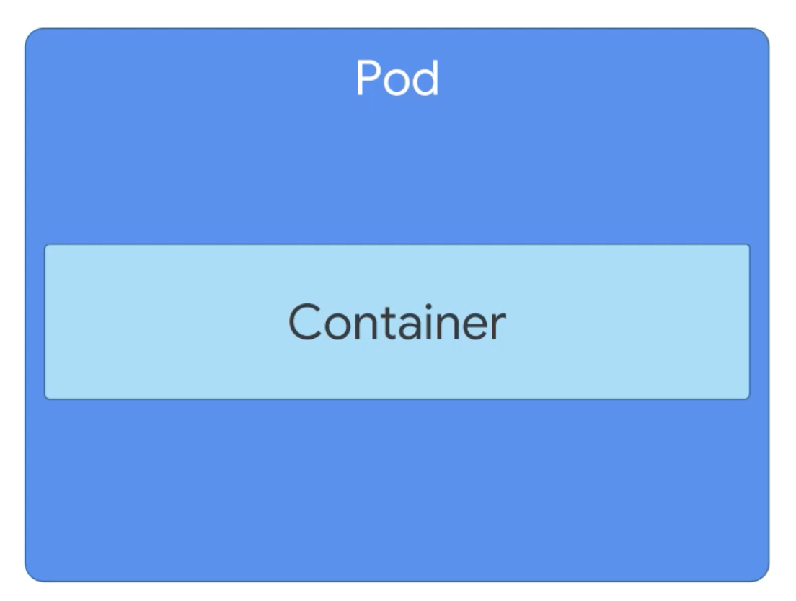
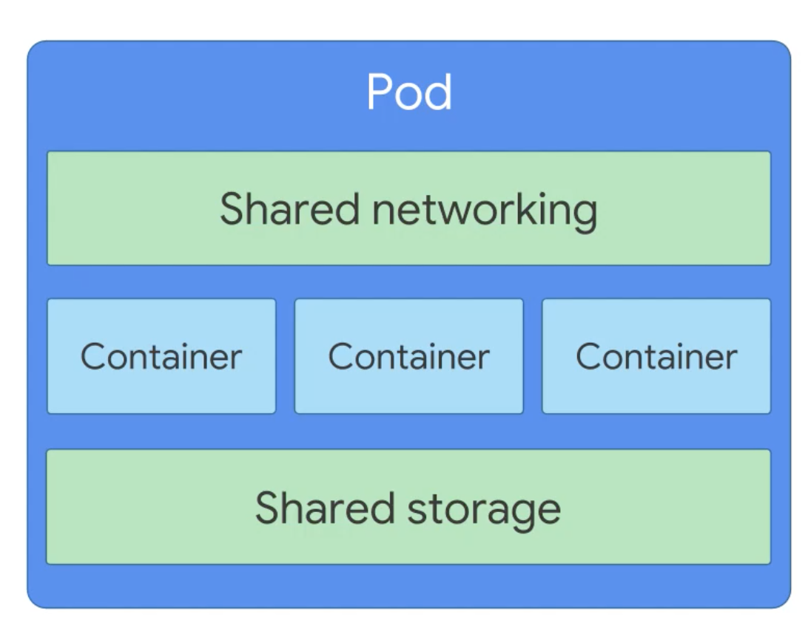

# Kubernetes

## Features

- Storage orchestration
- Automate rollouts/rollbacks (for instance, ensure a 0 downtime deployment by deploying an app without destroying the currently deployed one)
- Self-healing
- Management of secrets and configuration
- Horizontal scaling

## Benefits

On top the benefits of containers, such as:

- Get new devs up to speed up and running
- Environment consistency
- Ship to prod faster

K8s can:

- Orchestrate these containers
- Zero downtime deployments
- Self healing if a container fails
- Easy to scale
- Create an e2e test env
- Ensure application scales properly
- Ensure secrets and config are working properly for all containers
- Perf test

## Installation

Easiest way to have it locally is to use Docker Desktop and enable Kubernetes from there. See [here](https://www.techrepublic.com/article/how-to-add-kubernetes-support-to-docker-desktop/

## Tools

- kubectl: the K8s command line interface.
- web ui dashboard: https://kubernetes.io/docs/tasks/access-application-cluster/web-ui-dashboard/

To install the ui:

- `kubectl apply -f https://raw.githubusercontent.com/kubernetes/dashboard/v2.0.0-beta8/aio/deploy/recommended.yaml`
- `k describe secret -n kube-system | less` and copy the token of type `Type: kubernetes.io/service-account-token`
- `kubectl proxy`
- open http://localhost:8001/api/v1/namespaces/kubernetes-dashboard/services/https:kubernetes-dashboard:/proxy/#/login
- paste the token copied above

## The K8s object model

From [PS - Architecting with Google Kubernetes Engine - Foundations](https://app.pluralsight.com/course-player?clipId=eb702673-601f-4409-87b9-1ee8f8be232f)

Kubernetes objects are composed of 2 elements:

- **Object spec**: desired state described the the user (us)
- **Object status**: current state described by K8s.

## Pods

Pods are environments for containers and the smallest deployable unit in k8s.
One pod can host one or more containers.

If there are more containers in a pod, they are tightly coupled.
They share resources, like networking and storage. Every Pod has an IP address.

### How a K8s cluster is composed
