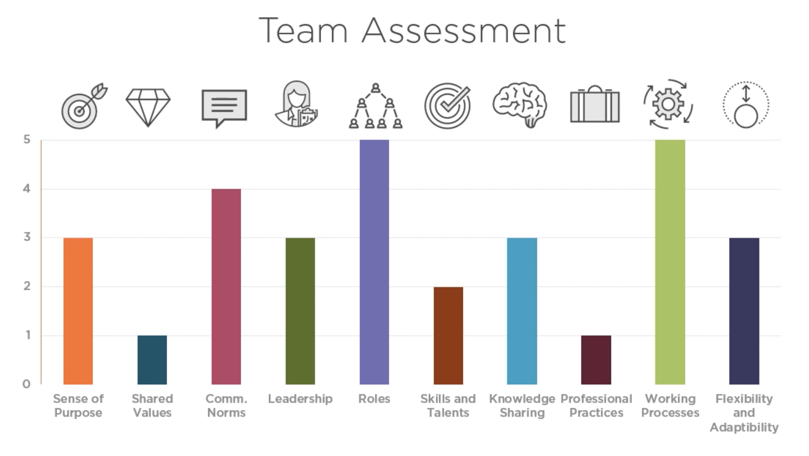

# Building a high performance team

Definition: "A team that always meets and frequently exceeds their goals"

Benefits for companies:

- Goals are reached
- Cost effective
- Attract talent

Benefit for team members:

- Great career and skills development
- Positive and creative atmosphere
- Sense of purpose

## Characteristics of HPT:

1. Sense of purpose
2. Shared values
3. Established communication norms
4. Superior leadership
5. Clearly defined and interdependent roles
6. Have complementary skills
7. Continuous learning and knowledge sharing
8. Quality awareness
9. Effective work processes
10. Flexible and adaptable

### Sense of purpose

- Clear what the short term and long term goals are
- Every team member knows how they are contributing towards these goals
- Goals are **measurable**

### Shared values

- They live and breathe their values
- All HPTs have these basic values: commitment, trust, respect, openness

### Established communication norms

- They agree on how feedback is given and received
- Members can influence team norms. While accepted every team members can vouch to change these rules.

### Superior leadership

- Leadership has a high impact on team's success

### Clearly defined and interdependent roles

- If i know my role, I know what are my minimal requirement for success at work

### Have complementary skills

- They join their forces and skills for a greater goal

### Continuous learning and knowledge sharing

- Both individual and group knowledge

### Quality awareness

- Use the right amount of best practices (but not too much if it is detrimental to delivery)
- Adopt practices that raise the quality all the time

### Effective work processes

- Great care in how processes work
- Constant ability to adapt them to new requirements

### Flexible and adaptable

- Change to their processes is welcome and proactively sought after

## Designing a new team: clarify the goals

- Write down the goals **before starting onboarding members**
- Ensure you have team goals
- Ensure you have individual goals
- As a leader you need to align company goals to team's goals

Example:

- **Company goal**: Provide a platform to buy quality food at fair prices
- **Checkout team goals**: Provide a quick, seamless and safe payment experience
- **Data analysis team goals**: Collect insightful data, store it safely and allow anyone in the company to access and consume it to increase every other team's output.

## From long term to short term goals

You start from defining long term goals and from there, you derive short term ones.

[See more](https://app.pluralsight.com/course-player?clipId=665a5bf8-f841-454b-885a-01d70770d6a2).

Short term goals are usually **sprint goals**

## Hiring for a new team

1. Hire for values - very hard to change a person's values. You want the values to align with the team ones
2. Skills and prospect

## Psychological safety

One of the **most important traits of a HPT**.
It's the climate at work when some feels free to speak up.
People are:

- secure to ask for help
- admit mistakes
- discuss existing problems
- share new ideas
- criticising a project

It's **NOT**:

- being nice
- being soft
- everything is great
- everything will work out
- low ambition

> **Problems** are how we get better every single day

People need to be comfortable in sharing problems, issues and bad results to the management.

- High psychological safety + no accountability = **comfort zone**
- Low psychological safety + high accountability = **anxiety**
- High psychological safety + high accountability = **thriving environment for HPTs**

## Joining an existing team

When joining, perform a team assessment. Rate based on the 10 characteristics of a HPT:

1. Sense of purpose
2. Shared values
3. Established communication norms
4. Superior leadership
5. Clearly defined and interdependent roles
6. Have complementary skills
7. Continuous learning and knowledge sharing
8. Quality awareness
9. Effective work processes
10. Flexible and adaptable

