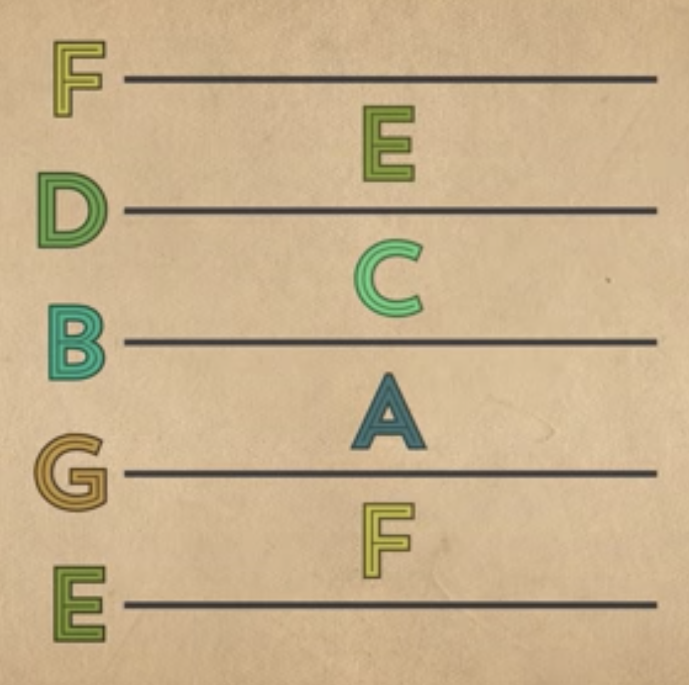
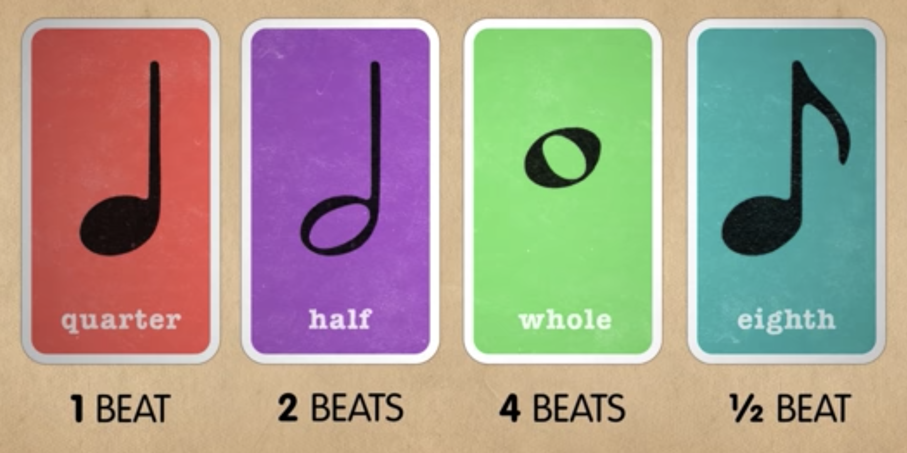

# Reading music

## Basics

Music is written on 5 parallel lines that go across the page. This is known as the **STAFF**.

The staff operates on 2 lines: up and down, and left to right.

The up and down axis determines the **pitch**, or which note to play.
Left to right determines the rhythm.

### Pitches

In the western music tradition the pitches are named:

> A, B, C, D, E, F, G

After that the cycle repeats itself.

There are of course many more pitches (or notes) that the ones we see in the picture above.
To condense all possible notes of an instrument we use a **clef**.

### Beat

This divides the tempo in equal parts. You usually use a metronome to keep the beat.

### Rhythm

The staff is divided in bars and the notes fill each bar.

## Chromatic scale

> C \_\_ D \_\_ E F \_\_ G \_\_ A \_\_ B C

1. Using sharps

> C C# D D# E F F# G G# A A# B C

(you read C sharp, D sharp etc)

2. Using flats

> C Db D Eb E F Gb G Ab A Bb B C

(you read D flat, E flat etc)

1. and 2. are actually **the same**, it's just a different notation.

## Scales

A scale is a pattern of whole and half steps, applied to the chromatic scale seen above.

See the animation [here](https://youtu.be/kvGYl8SQBJ0?t=234).

### Major scales

For instance if we want to see the A major scale:

> C C# D D# E F F# G G# A A# B C

We start from A:

> **A** A# B C C# D D# E F F# G G# A

And we apply the **major pattern**:

> W W H W W W H

Where W is a whole step and H is a half step.
So first one is a whole step. We go from the 1st note (the A) to the next full note, B

> **A** A# **B** C C# D D# E F F# G G# A
> **W** W H W W W H

Then we do another whole step, that will take us to C#

> **A** A# **B** C **C#** D D# E F F# G G# A
> **W** **W** H W W W H

Then we do a half step, that will take us to C#

> **A** A# **B** C **C#** **D** D# E F F# G G# A
> **W** **W** **H** W W W H

And so on.

### Minor scales

Minor scales follow the same logic, but a different pattern:

> W H W W H W W

### Scale degrees
