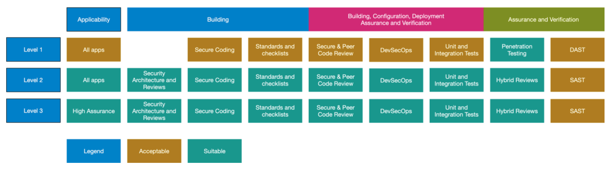

# Application Security Verification Standard

This is mostly based on [OWASP ASVS (pdf)](https://www.owasp.org/images/d/d4/OWASP_Application_Security_Verification_Standard_4.0-en.pdf).

3 security verification levels:

1. low assurance level. This is the bare minimum. Attacks that this can shield from are easy-to-exploit vulnerabilities
2. for most apps that contain sensitive data (pretty much any commercial project out there)
3. high value transactions, medical data and such

Black box testing is **not** enough.

> Black-box testing is a method of software testing that examines the functionality of an application without peering into its internal structures or workings.

It's suggested to replace black box testing with tests that inspect and assess the source code.

The ASVS is a blueprint to create a **Secure Coding Checklist** that is **application/organisation specific**.

## V1.1 Secure Software Development Lifecycle Requirements

1.1.1 - Verify the use of a secure software development lifecycle that addresses security in all stages of development.

1.1.2 - Verify the use of threat modeling for **every design change** or sprint planning to identify threats, plan for countermeasures, facilitate appropriate risk responses, and guide security testing.

1.1.3 - Verify that all user stories and features contain functional security constraints, such as "As a user, I should be able to view and edit my profile. I should not be able to view or edit anyone else's profile"

1.1.4 - Verify documentation and justification of all the application's trust boundaries, components, and significant data flows.

1.1.5 - Verify definition and security analysis of the application's high-level architecture and all connected remote services.

1.1.6 - Verify implementation of centralized, simple (economy of design), vetted, secure, and reusable security controls to avoid duplicate, missing, ineffective, or insecure controls.

1.1.7 - Verify availability of a secure coding checklist, security requirements, guideline, or policy to all developers and testers.
