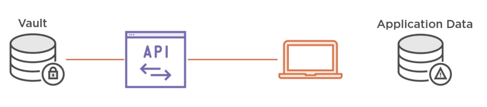
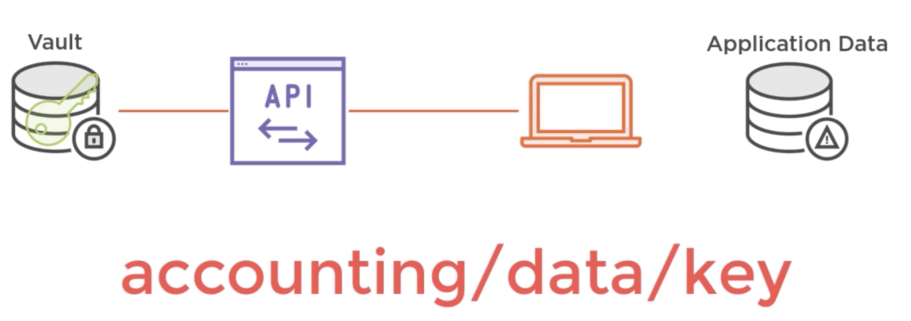
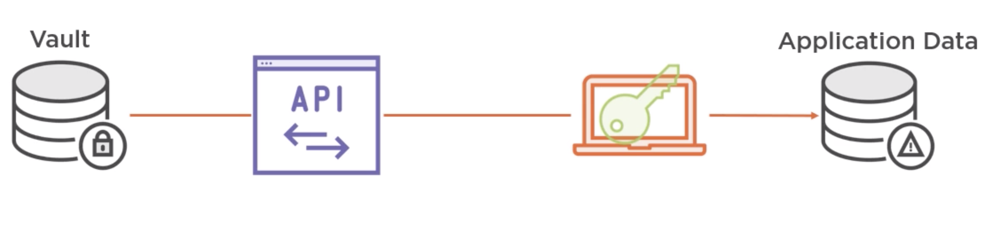

# Security: Cryptography

## Hash algorithms or digests

One way functions that given an input produce a hash as output.

## What is a hash?

A hash is:

- a **fixed-length** string
- deterministic
- collision resistant
- unidirectional

This info is based on [Node's Crypto documentation](https://nodejs.org/en/knowledge/cryptography/how-to-use-crypto-module/).

### Fixed length

For example, SHA-256 hashes are **always** 256 bits long whether the input data is a few bits or a few gigabytes.

### Deterministic

Same input === same output. This makes hashes useful for [checksums](https://en.wikipedia.org/wiki/Checksum).

### Collision resistant

Hash algos are designed to make it unlikely that two different inputs yield the same hash.

### Unidirectional

It should be very easy to go from input to hash, but very hard to go the opposite direction.

## Hashing algorithms

You can create a hash and then try to see if [Hash Toolkit](https://hashtoolkit.com/reverse-hash) can decrypt it. The most common passwords will be guessable by that tool.
You can try:

- "ef92b778bafe771e89245b89ecbc08a44a4e166c06659911881f383d4473e94f" - "password" through SHA-256, will be guessed
- "643c5b36edb46869d5471e49fb12c23a6285b46e765105db14ce8d84dd7d3503" - "aziT7662" again SHA-256, will not be found

(Hash toolkit is using rainbow tables).

### MD5

- Message Digest 5
- Cryptographic hash function created in 1992
- Many vulnerabilities have been discovered so far, so it's no longer safe for protecting passwords

### Recommended algorithms for passwords

Argon2, PBKDF2, crypt, bcrypt (very popular).

## HMAC

- Hash-based Message Authentication Code
- defines the process of applying a hash to both the data and a secret key
- the result is one single hash

So 2 inputs (data and key), 1 output (hashed output).

It checks for **integrity** AND **authenticity** (the data and the key are validated).

## Protecting passwords with salts

Two SAME passwords belonging to DIFFERENT users will yield a different hashed result.

- must be generated randomly for each user on registration
- it is appended to the password and then hashed
- optionally one can specify a number or rounds (say, repeat the hashing operation 10 times)
- one stores the output of the hash function and the salt itself

To then compare the password on successive logins, we take the password, we append the salt, we redo the calculation and compare the result.

This is a dummy, dumbed down version of what happens when we apply salt and hash a password, implemented in Js.

**IF YOU ARE READING THIS: DO NOT COPY PASTE THIS CODE, USE AN IMPLEMENTATION LIKE BCRYPT. THIS CODE IS ONLY MEANT AS A SIMPLIFIED VERSION TO EXPLAIN THE PROCESS.**

```js
const crypto = require("crypto");

function sha(password) {
  return crypto
    .createHash("sha256")
    .update(password)
    .digest("hex");

}

function getRandomString() {
  return 'not-really-random-salt-for-this-demo';
}

function hash(password, rounds = 10) {
  // generate a random string of at least length n to use as salt
  const salt = getRandomString();
  let hashed = sha(`${salt}${password}`);
  for (let i = 0; i < rounds; i++) {
    hashed = sha(hashed)
  }


  return `${salt}/${rounds}/${hashed}`;
}

function compare(rawPassword, hashedPwFromDB) {
  const [salt, rounds, pw] = hashedPwFromDB.split('/');
  const hashed = hash(rawPassword, rounds);
  return hashedPwFromDB === hashed;
}
// usage:
// 1. User registers a new account, in the DB we store
const newUser = {
  email: 'john@mc.com',
  password: hash('very-safe-password')
}
// 2. User logs in, an passes credentials:
{
  email: 'john@mc.com',
  password: 'very-safe-password'
}
// 3. We retrieve the user row from the the DB
{
  email: 'john@mc.com',
  password: 'not-really-random-salt-for-this-demo/10/4ad31e6e04a0e0f8713522f0f378a798dc1dde89c81a652e8c6c24a4dacdb74a'
}
// 4. We compare
const ret = compare('very-safe-password', 'not-really-random-salt-for-this-demo/10/4ad31e6e04a0e0f8713522f0f378a798dc1dde89c81a652e8c6c24a4dacdb74a');
console.log(ret)
// true
```

In an implementation that is closer to real life we would see:

```js
const bcrypt = require("bcrypt");

const rounds = 10;
const password1 = "very-safe-password-me-thinks";

bcrypt.hash(password1, rounds, (err, hash) => {
  // '$2b$10$S3ptFBZB7C4/0ofGSEo8MegfbiKa4LyJViLc5RaaxQsOGMaA1nlZq'
  // Store hash in your DB, as is.
  console.log(hash);
});

bcrypt.compare(
  password1,
  "$2b$10$S3ptFBZB7C4/0ofGSEo8MegfbiKa4LyJViLc5RaaxQsOGMaA1nlZq",
  (err, res) => {
    // res == true
  }
);
```

## Encryption

> The key difference between encryption and hashing is that encrypted strings can be reversed back into their original decrypted form if you have the right key.
>
> -- [source](https://www.securityinnovationeurope.com/blog/page/whats-the-difference-between-hashing-and-encrypting)

So, **encryption** is made to work both ways, while **hashing** is made to work only from clear text to hashed.

> Encryption should only ever be used over hashing when it is a necessity to decrypt the resulting message. For example, if you were trying to send secure messages to someone on the other side of the world, you would need to use encryption rather than hashing, as the message is no use to the receiver if they cannot decrypt it.
>
> If the raw value doesn't need to be known for the application to work correctly, then hashing should always be used instead, as it is more secure.

### Symmetric key encryption

One key that works both ways. Used for data at rest.

### How to store keys to encrypt and decrypt

Keys can be managed by using a KMS (Key management system).

- Keys are put into a key store
- Keys are then encrypted via the usage of a master key
- Keys can be rotated for extra security

Amazon provides Amazon Key Management Service or [KMS](https://aws.amazon.com/kms/), Hashicorp offers [Vault](https://www.vaultproject.io/), which is open source.

As an example, here's how a workflow with Vault looks like:

1. At rest, the DB is encrypted and Vault is unable to access it. Vault doesn't hold the master key and as such is unable to access it.


2. Vault uses a technique called Shamir's Secret Sharing. The **master key** is broken into many different keys called **shards**. These shards are distributed to trusted administrators or computers. A **minimum** number of shards is required to access. Say the key is broken into 5 shards and we say that at least 3 of them are required for access. Vault uses the shards to recreate the master key.


3. When we need access, Vault provides an API that a server or client (the drawing below shows a client, but in reality this will most of the times happen on servers) can interrogate to get the keys. The server will authenticate via either username/pw or - preferably - via a certificate that is installed on the server itself



4. Once authenticated, the server will request a specific key within the vault by specifying a path



5. The client or server has the key, so can finally access the target DB.



### Asymmetric key encryption

Works via public key mechanism.
It uses 2 keys, one to encrypt and one decrypt. This is known as the **public and private key pairs**.
