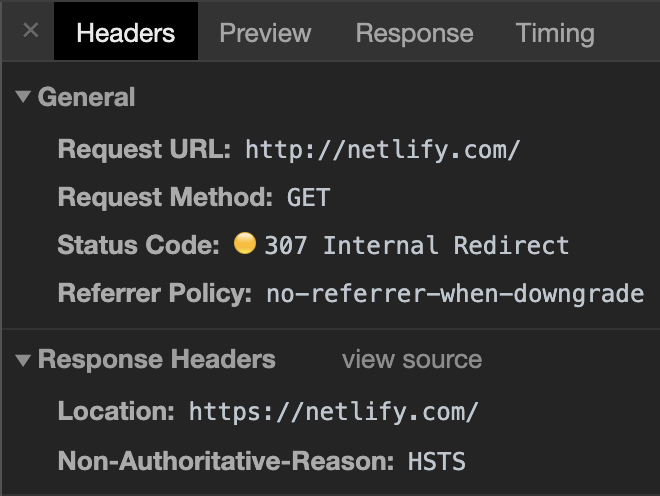

# HTTPS

## MitM (Man in the middle)

Typical insertion points include:

- the connection between client and router (1)
- the router itself
- the connection between router and ISP (2)
- the ISP itself
- the connection between ISP and server, eg governments can intercept traffic (3)

```
  ----------   1    ----------   2   ----------   3   ----------
  | client | ---->  | router | ----> |   ISP  | ----> | server |
  ----------        ----------       ----------       ----------
```

Basically every node and every transition of data can be a potential insertion point for a MitM attack.

## HTTPS value proposition

- **Confidentiality**: we want to be sure that info that we send from client to server remains secret (we read an email, we send a pw etc.).
- **Integrity**: we want to be sure that info is not tampered with. so responses arrive as they are sent by the server, and for example malware is not injected into the page.

For instance:

> Malicious code injected into Tunisian versions of Facebook, Gmail, and Yahoo! stole login credentials of users critical of the North African nation's authoritarian government, according to security experts and news reports.
>
> [...]
>
> After more than ten days of intensive investigation and study, Facebook's security team realized something very, very bad was going on,” The Atlantic article stated. “The country's internet service providers were running a malicious piece of code that was recording users' login information when they went to sites like Facebook.
> -- [source](https://www.theregister.co.uk/2011/01/25/tunisia_facebook_password_slurping/)

- **Authenticity** so we are actually confident we are really talking to the server we think we're talking to. HTTPS avoids attacks such as DNS hijacking (by poisoning the DNS, forcing them to resolve to different IP addresses that correspond to rogue sites).

## CA (Certificate authorities)

When the browser receives the cert from a server, it checks whether the CA is trusted, by checking against a list of CAs.

Every browser follows a different list:

- Firefox: https://www.mozilla.org/en-US/about/governance/policies/security-group/certs/included/
- Chrome: it uses the certificates [included with the OS][1].
- Opera: it installs the most used CA when installing the application, you can find the rest in the online root repository: https://certs.opera.com/
- iOs: https://support.apple.com/kb/ht5012

([source](https://security.stackexchange.com/a/49008/155108))

> The Mozilla CA Certificate Program's list of included root certificates is stored in a file called [certdata.txt](https://hg.mozilla.org/releases/mozilla-beta/file/tip/security/nss/lib/ckfw/builtins/certdata.txt) in the Mozilla source code management system.
>
> -- [source](https://wiki.mozilla.org/CA/Included_Certificates)

> Google Chrome attempts to use the root certificate store of the underlying operating system to determine whether an SSL certificate presented by a site is indeed trustworthy, with a few exceptions.
>
> -- [source](http://www.chromium.org/Home/chromium-security/root-ca-policy)

New CAs are added and removed with time.

A staple of CAs is that **they can only issue certs to owners of the domain they are certifying**.
It has be noted that a certificate does only confirm that the domain us owned by the recipient of the cert.

## SSL

- Secure Socket Layer
- built by Netscape in the 90s
- superseded by TLS

## TLS

- Transport Layer Security
- built in 1999
- a **direct** upgrade of SSL 3.0

## SSL and TLS

TSL and SSL terms are used interchangeably, since TLS is a direct upgrade of SSL, but basically SSL reached EOL in 2014. When people say SSL they pretty much every time mean TLS.
**TLS is the current standard for implementing HTTPS**.

A server and a browser communicating might support different versions of TLS.
For instance:

- server A supports TLS v.1.3 (and lower)
- client B supports TLS v.1.2 (and lower)

The standard is to fallback to the **highest commonly supported versions** (in this case 1.2).

TLS and SSL are cryptographic protocols designed to provide communication security over a computer network.

> The connection is private (or secure) because symmetric cryptography is used to encrypt the data transmitted. The keys for this symmetric encryption are generated uniquely for each connection and are based on a shared secret that was negotiated at the start of the session (see [TLS handshake](../networking/README.MD#TLS&sp;handshake)). The server and client negotiate the details of which encryption algorithm and cryptographic keys to use before the first byte of data is transmitted.
>
> The negotiation of a shared secret is both secure (the negotiated secret is unavailable to eavesdroppers and cannot be obtained, even by an attacker who places themselves in the middle of the connection) and reliable (no attacker can modify the communications during the negotiation without being detected).
>
> The identity of the communicating parties can be authenticated using public-key cryptography. This authentication can be made optional, but is generally required for at least one of the parties (typically the server).
>
> The connection is reliable because each message transmitted includes a message integrity check using a message authentication code to prevent undetected loss or alteration of the data during transmission.

The implementation of TLS and SSL protocols is open source and provided by [Open SSL](https://en.wikipedia.org/wiki/OpenSSL). The implementation is written in C, and the various languages provide wrappers around it to make them available to various platforms/systems, for ex. the [module `crypto` in Node](../node/crypto.md).

## Securing an app via Https

### Redirect traffic from http to https

The idea is to instruct the server to respond to a request such as `http://wwww.mysite.com` with a 301 PERMANENT REDIRECT to https version.

A request such as

```
GET /index.php HTTP/1.1
Host: www.example.org
```

Will receive a response like:

```
HTTP/1.1 301 Moved Permanently
Location: https://www.example.org/index.php
```

The browser will then re-request the same page over https.

There's a problem though. Every time a request is issued for `http://www.example.org` and the server responds, this first request is done over a non secure connection.
This is **an insertion point for a Man in the middle attack**.
That's where STS comes into play.

### HSTS or STS

Hsts (http strict transport security) aims to solve this problem.
The picture below is me trying typing `http://netlify.com` on a browser and hitting enter.
Note the 307 Internal redirect, the "Location" (that instructs the browser to actually request `https://netlify.com`, which will in turn respond with a 301, redirecting to the www subdomain), and the "non-authoritative-reason: HSTS"



If we inspect a request to site that has HSTS turned on, we will se something like:

```
strict-transport-security: max-age=31536000
```

This instructs the browser that for the whole duration of max-age, every outbound request to that website originating as `http`, will be upgraded automatically to `https` **internally, before even hitting wire**.

This is now much better, but still, the first part of the request is insecure.

### HSTS preloading

> [...] used to submit domains for inclusion in Chrome's HTTP Strict Transport Security (HSTS) preload list. This is a list of sites that are hardcoded into Chrome as being HTTPS only.

It's done via [this form](https://hstspreload.org/).
Once added to the list, the website will not even send the first request as http, it will - **even the first time** - send out an https request, straight from the browser.

This is a one way operation, rolling back is not possible.

### Mixed content

Mixed content is when a page is served over https but some of its components, such as some images, are requested over http. You generally see:

- a **warning** if the resource is "inactive", as in, it can't contain scripts, such as an image. The image will be loaded, but the green padlock will be go away
- an **error** if the resource is "active", such as an iframe. In this case the resource is refused.

Mixed content can be avoided entirely by using the CSP's directive `upgrade-insecure-requests`.

### Securing cookies

Secure cookies will be sent only over https. The same page served via http will simply not send the cookie when the request is issued.

### HPKP

This stands for "Http public key pinning)"

- Implemented as a header
